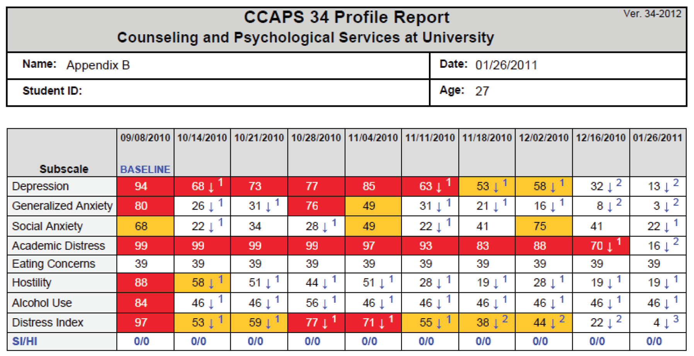
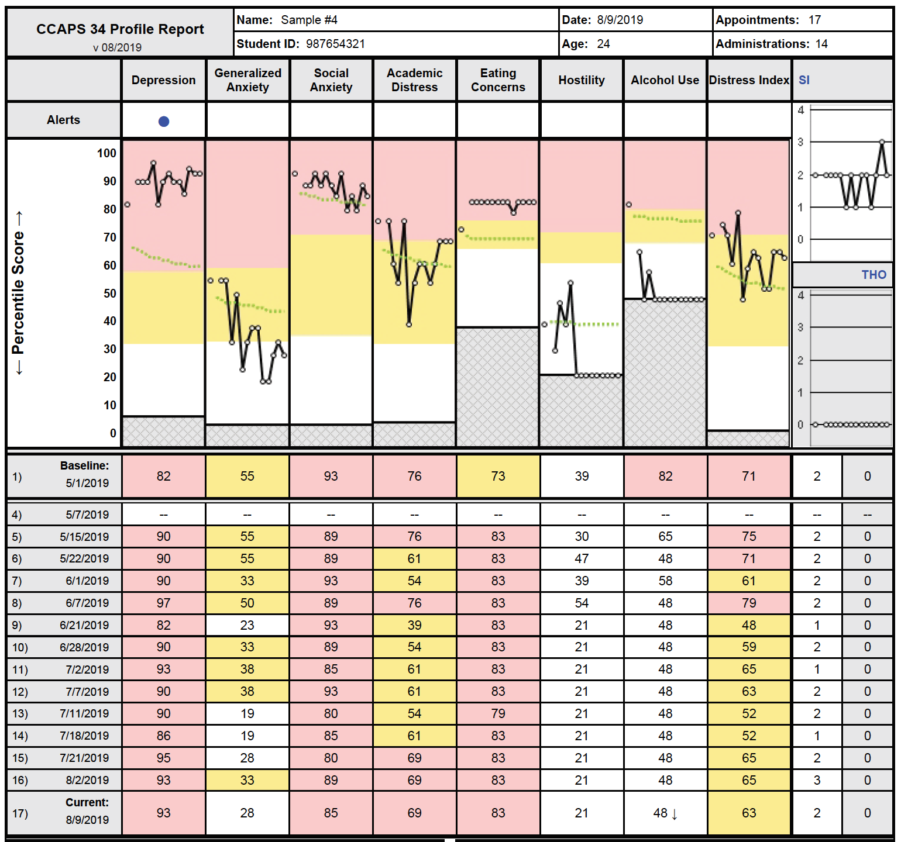
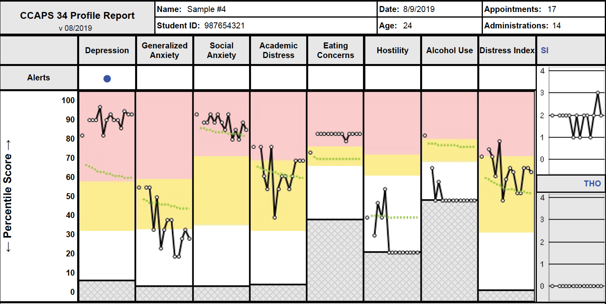

<style>
.remark-slide-content.hljs-default {
  border-top: 80px solid #008080;
}

.remark-slide-content {
  font-size: 24px;  
}

.remark-slide-content > h1 {
  font-size: 40px;
  

</style>

# Overview

**Goal of the project:** Evaluate the impact of the 2015 change to the CCAPS profile report

**Goal of this presentation:** Get clinician perspective on using the CCAPS profile report and the feedback it provides

???
I'm going to first present my general reserach questions and methods, then transition into a discussion format to get input from you on your experience with the CCAPS and what would be important to capture. Feel free to ask quesitons along the way.

---
# Background
- Some portion of clients get worse during treatment
- Clinicians have trouble identifying within their own caseload which clients will get worse

---
# Deterioration rates

```{r echo=FALSE, message=FALSE, warning=FALSE}
require(tidyverse)
xlsx::read.xlsx("Deterioration rates by subscale_updated.xlsx", sheetIndex = 1) %>% 
  filter(NA. == "Deterioration") %>% 
  select(-NA., -Any_subscale) %>% 
  select(Depression = Depression_deter, Anxiety = Anxiety_deter, `Social Anxiety` = SocialAnxiety_deter, Academics = Academics_deter, Eating = Eating_deter, Alcohol = Alcohol_deter, DI = DI_deter) %>% 
  mutate_all(scales::percent) %>% 
  knitr::kable(format = "html")
```

13.5% of clients deteriorate on at least one subscale.  
---
# Background
- Routine outcome monitoring and feedback reduces deterioration and improves client outcomes  
<br>
- Mixed evidence on whether these benefits extend only to clients who would have deteriorated or if all clients benefit

---
# CCAPS profile report change

.pull-left[
.center[Old report]

]

.pull-right[
.center[2015 report] 

]


---
# 2015 CCAPS Profile Report

  
Graphical representation of client scores  
Expected change trajectory  
Visual cut score boundaries  
Off track feedback alert  

???
Who used the old CCAPS profile report and experienced the transition to the new report?

---
# Research Questions
1. Did counseling center outcomes improve after the profile report changed?
1. Does the effect of feedback differ by center?
1. Does the effect of feedback differ by subscale?
1. Does feedback improve outcomes for all clients or only those who would have otherwise deteriorated?
1. Are there client and systemic moderators that impact how effective feedback is?

---
# Methods
- CCMH has data from before and after the 2015 profile report was introduced
- Schools updated to the new profile report at various times, and we don't know the exact date that each center updated
- Analyses will include two years of data prior to 2015 report release (2013-2015) and two years of data one year after the report was released (2016-2018)  
<br>
- Results in a sample of 105 centers
- Outcomes for these centers will be compared before and after the new report 

???
We know the date they downloaded the updated that made the report available, but they could change the date that it became active in their system, either retroactively applying it to old reports, or defering it until the beginning of the semester.
Leaving a window also allows for a period of acclimation, so we're not just capturing the effect of something new being introduced. 

---
# Outcomes

- CCAPS change
- Rate of CCAPS change 
- Rate of deterioration (overall and by subscale)
- Rates of improvement
- Number of sessions
- Rate of dropout

---
# Client moderators

**For whom is feedback most effective?**  

--

- SDS mental health history items
- Initial CCAPS scores
- When in treatment an alert occurs
- Number of alerts a client receives
- Variability in client's scores during treatment
- Whether the client was in multiple treatment modalities

--

*Other client moderators?*

---
# Systemic moderators

**Under what conditions is feedback most effective?**

--

- Frequency of CCAPS administration  
- Therapist's caseload  
<br>  
--

- Therapist's consistency in viewing and attending to CCAPS report
- Therapist's feelings about the importance of routine outcome monitoring and feedback
- Center's culture around the CCAPS and its importance
- How the center introduced the CCAPS and the new profile report. Did therapists feel it was forced on them?  
<br>  
--
*Other systemic moderators?*

---
# Methodological issues
- CCAPS ceiling effect. There are clients who start too high to deteriorate, and too high to alert (represented by a - where a feedback alert would be)  
- Can't control for the confounding effect of time, changing policies, etc

---
# Questions

- What was your experience transitioning from the old report to the new report? 
- Did the change impact the way you worked with clients or used the CCAPS in sessions?  
<br>
--

- Do you feel like it improved outcomes? For all clients? Certain types of clients?  
<br>
--

- How do you interpret the CCAPS off track alert? The graphical representation of CCAPS change?  
<br>
--

- How do you use the CCAPS and CCAPS feedback in sessions with your clients?  

---
# Thank you!
